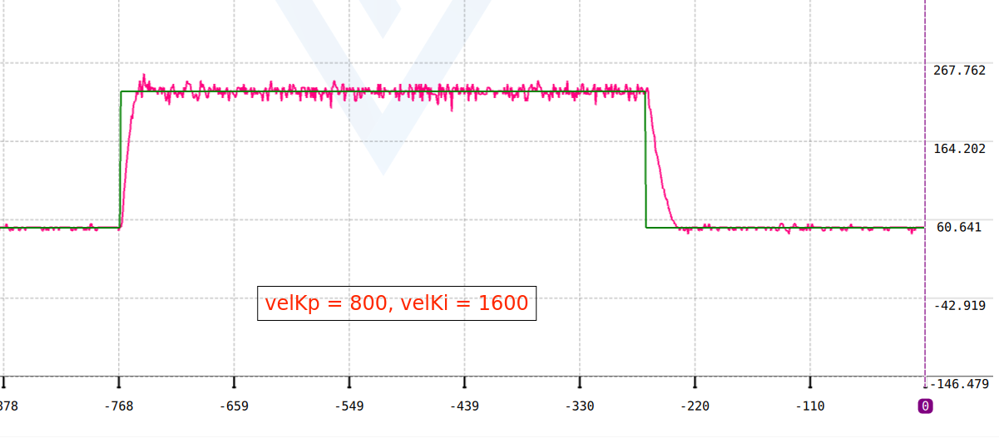

# STM32F401CCU6	增量式PI 速度环

## 硬件资源

- STM32F401CCU6主控
- 直流有刷电机
- 有刷电机驱动板
- 1或2路PWM
- 1或2路中断

### 定时器分配

| 定时器 | 工作模式 | 功能 |
| TIM1 | 1kHz 2路PWM | 用于PWM控制2个直流有刷电机 |

### 中断分配

| 定时器 | 工作模式 | 功能 |
|:-:|:-:|:-:|
| EXTI0 | 上升沿触发  下拉 | 检测电机1编码器 |
| EXTI1 | 上升沿触发  下拉 | 检测电机2编码器 |

## 调试过程
由于我之前用矩阵键盘调过参数，Kp和Ki的参数已经比较优秀，我便没有再使用串口或者按键去调参，Kp和Ki的值如下表：

|Kp|Ki|
|:-:|:-:|
|800|1600|

另外，采样时间是**1ms**。

调试出来的波形图如下:

增量式 PI 中的 P 和 I 的作用与位置式 PID 的作用不同，在我调试的过程
中，我发现增量式 PI 的 P 与位置式 PID 的 D 相似，增量式 PI 的 I 与位
置式 PID 的 P 相似。

增量式 PI 各参数的作用如下表：

|增量式 PI|作用
|:-:|:-:|
|P|抑制振荡，但会放大高频噪声|
|I|提高响应速度，但会放大振荡|
